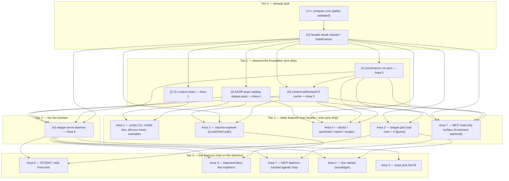

# steppe — The Experience Layer: MASTER UX Architecture

*The engineering architecture of steppe's experience/UX layer. How the seven Areas are built — folder scaffolding, tech-stack decisions, interfaces to the existing compute, and packaging — grounded in the real code.*

---

## 0. What this document is (and is not)

There are two complementary documents:

| Document | Question it answers | Contents |
|---|---|---|
| **`docs/EXPERIENCE-PLAN.md`** *(the PRODUCT plan)* | **What / why** | The vision, the seven Areas, per-feature delight tables, the impact×feasibility matrix, the pre-ship sprint, the wild ideas. |
| **`docs/ux/UX-ARCHITECTURE.md`** *(this — the MASTER ENGINEERING architecture)* + the seven `docs/ux/areaN-*.md` docs | **How** | Folder/package trees, extend-vs-new-vs-separate fit decisions, the concrete tech/stack choices with alternatives weighed, the key interface signatures, the shared-infrastructure ownership, the dependency graph + build order, the packaging extras. |

This master doc is the **top of the architecture tree**: it draws the whole picture — the full target scaffolding, the shared infrastructure and who owns each piece, the cross-area dependency DAG and build order, and the packaging plan — and defers per-Area detail to the seven sibling docs. It **references** the product plan's features; it does **not** restate its feature tables.

**The one architectural truth under everything** (from the plan §1): *the compute is done and parity-validated; the speed is the whole pitch and it is currently invisible.* The experience layer's job is to make the speed **felt** without touching the golden-gated engine. Almost every piece is **Python over the existing nanobind facade**; only Area 1 (pretty CLI output) is primarily **C++**, because it extends the one C++ output seam.

### 0.1 The two hard constraints every decision is designed around

1. **steppe is GPU-only, so interactive compute is SERVER-SIDE.** There is no CPU runtime path (memory *cpu-is-test-only*) and no WASM/pyodide: a real fit needs a CUDA 13 / Blackwell device. Therefore every "live" feature (STUDIO, the marimo explorers, the MCP agentic loop) runs its **compute on a CUDA box**; the browser/notebook/agent is a **thin client** to a server-side GPU process. In-docs "interactivity" is honest only as **precomputed replay** (executed once on a GPU box at docs-build time). This is why Area 6's `steppe serve` daemon is the linchpin: it is the one process that holds the GPU context and f2 in VRAM, and every live surface talks to it.
2. **The base wheel stays LEAN.** `pyproject.toml` today declares exactly **one** hard runtime dep — `numpy>=1.22` — and lazily imports `pandas` inside the DataFrame accessors (`_require_pandas`, `bindings/steppe/__init__.py:83`). Every heavy experience dependency (matplotlib, plotly, marimo, graphviz, fastapi, fastmcp, weasyprint, …) becomes an **optional extra** (`steppe[viz]`, `steppe[notebook]`, `steppe[app]`, `steppe[mcp]`, `steppe[all]`), imported behind a guard that mirrors `_require_pandas`. `import steppe` must remain numpy-only.

---

## 1. The codebase we are building on (the real seams)

Everything below is grounded in files that exist today:

- **The C++ CLI** — `src/app/`, the `steppe` binary, **14 subcommands** (`qpadm`, `qpgraph`, `qpgraph-search`, `dates`, `qpwave`, `f4`, `qpdstat`, `f3`, `f4-ratio`, `f4-sweep`, `f3-sweep`, `qpfstats`, `qpadm-rotate`, `extract-f2`). Every command's bytes funnel through **one seam**: `emit_to_destination(config, prefix, write)` in `src/app/cmd_emit.hpp:60` → format select (`OutputFormat{Csv,Tsv,Json}`, `result_emit.hpp:38`) → the command's `write(std::ostream&, OutputFormat)` serializer → `finish_emit()`. The library never prints; `main()` owns streams. There is **no** isatty/color/progress/completion code anywhere (grep-confirmed). Each CLI11 callback ends in `std::exit()` — there is **no post-emit hook in-process**.
- **The nanobind facade** — `bindings/steppe/__init__.py`, **23 public `__all__` names**, a thin pandas-friendly skin over `steppe._core`. The stable, frozen result surface the whole Python experience layer consumes: `QpAdmResult` (`.weights`/`.rankdrop`/`.popdrop` DataFrames + `p`/`chisq`/`dof`/`est_rank`/`f4rank`/`status:Status`/`feasible` scalars), `QpWaveResult`, `F4Result`, `F3Result`, `F4RatioResult`, `QpGraphResult`, `QpGraphSearchResult`, `DatesResult`, `F2Blocks`, plus `read_f2`/`extract_f2`/`qpadm`/`qpadm_search`/`f4`/`f3`/`f4ratio`/`qpdstat`/`dates`/`qpgraph`/`qpgraph_search`/`qpfstats`. `pandas` is lazy (`_require_pandas`).
- **Packaging** — `pyproject.toml` with scikit-build-core: builds only `_core` (`build.targets=["_core"]`), copies the pure-Python package (`wheel.packages=["bindings/steppe"]`), and **`-DSTEPPE_BUILD_CLI=OFF`** — so `pip install steppe` yields `import steppe` but **no `steppe` command on PATH**. Version single-sourced from `CMakeLists.txt project(VERSION …)`.

The recurring architectural fork per Area is: **EXTEND** an existing seam (the C++ emit funnel; the facade) vs a **NEW** Python subpackage (`bindings/steppe/<name>/`) vs a **SEPARATE** app (the `web/` front-end). The table in §6 records the decision for each.

---

## 2. The target scaffolding (the full tree)

The experience layer adds to four places: the **C++ CLI** (`src/app/`, Area 1 only), the **Python package** (`bindings/steppe/`, five new subpackages), a **separate front-end** (`web/`, Area 6), and **`examples/notebooks/` + `docs/ux/`**. Legend: **[EXTEND]** existing seam · **[NEW-SUB]** new Python subpackage in the wheel · **[SEPARATE]** its own build/CI.

```
src/app/                              # [EXTEND] Area 1 — the ONE C++ area (into steppe_app + steppe::access)
  cmd_emit.hpp                        #   (exists) EXTEND: Auto -> Table on isatty(stdout); route Table to pretty_emit
  result_emit.{hpp,cpp}               #   (exists) EXTEND: OutputFormat::Table; parse_output_format accepts auto/table/pretty
  cli_parse.cpp                       #   (exists) EXTEND: --color/--progress/--quiet/--verbose; register 2 new subcommands
  pop_resolver.cpp                    #   (exists) EXTEND: fuzzy::suggest on a resolve miss ("did you mean …")
  pretty_emit.{hpp,cpp}               #   NEW — emit_<stat>_pretty(), sibling of result_emit, reuses the SAME result structs
  fuzzy.{hpp,cpp}                     #   NEW — bounded Levenshtein + token-overlap; COMPILED INTO steppe::access (shared)
  cmd_completions.{cpp,hpp}           #   NEW — `steppe completions {bash,zsh,fish}` + hidden `steppe __complete`
  cmd_examples.{cpp,hpp}              #   NEW — `steppe examples` cheat-sheet
  render/                             #   NEW module (pure host C++20, no CUDA), into steppe_app
    ansi.{hpp,cpp}                    #     SGR + ColorMode{Auto,Always,Never} + isatty gate + NO_COLOR
    table.{hpp,cpp}                   #     width-aware aligned renderer, reuses fmt_double
    significance.hpp                  #     |Z| / p color RULES
    model_line.{hpp,cpp}              #     the qpAdm one-line verdict sentence (headline)
    explain.{hpp,cpp}                 #     --explain narrator
    sparkline.{hpp,cpp}               #     braille/block sparklines
    progress.{hpp,cpp}                #     Tier-0 stderr progress, isatty(2)-gated
  completions/steppe.{bash,zsh,fish}  #   NEW — hand-authored completion templates (embedded as string resources)

bindings/steppe/                      # the facade package (ships in the base wheel via wheel.packages)
  __init__.py                         #   (exists) EXTEND: add PlottableMixin.plot accessor; guarded re-exports of the subpackages
  _resident.py                        #   [NEW] Area 6 — thin wrapper over a resident-DeviceF2Blocks handle (the one new binding)

  plot/                               # [NEW-SUB] Area 2 — steppe.plot (extra: viz / viz-*)
    __init__.py spec.py theme.py palette.py embed.py export.py panel.py provenance.py
    figures/  weights.py forest.py decay.py heatmap.py rotation.py embed.py graph.py
    backends/ base.py _mpl.py _plotnine.py _plotly.py _altair.py _graphviz.py _terminal.py

  pops/                               # [NEW-SUB] Area 4 — steppe.pops, the AADR catalog (extra: pops)
    __init__.py anno.py suffixes.py regions.py schema.py index.py catalog.py
    fuzzy.py cards.py registry.py build.py paths.py _emit.py cli.py __main__.py

  explore/                            # [NEW-SUB] Area 3 — reactive notebooks/apps (extra: notebook)
    __init__.py _marimo.py client.py widgets.py _launch.py _provenance_cell.py
    notebooks/  qpadm_explorer.py rotation_leaderboard.py sweep_explorer.py

  workflow/                           # [NEW-SUB] Area 5 — manifest/cache/doctor/recipes/cite (extra: workflow / report)
    __init__.py _hashing.py provenance.py cache.py diagnostics.py doctor.py
    quickstart.py cite.py cli.py                       #   <-- OWNS the Python `steppe` front-door console script
    report/  __init__.py render.py interpret.py templates/{base,qpadm,f4,dates}.html.j2
    recipes/ __init__.py schema.py steps.py builtin/{is-admixed,reproduce-paper,build-a-graph}.yaml
    data/quickstart/                                    #   tiny real-AADR subset / fetch-manifest

  serve/                              # [NEW-SUB] Area 6 — the steppe serve daemon (extra: app)
    __init__.py __main__.py app.py config.py worker.py queue.py registry.py session.py protocol.py
    routes/   ws.py fit.py pops.py graph.py sweep.py share.py health.py
    services/ fit_service.py sweep_service.py graph_service.py stability.py
    static/                                             #   (build-time) the compiled web/ bundle copied here

  mcp/                                # [NEW-SUB] Area 7 — the FastMCP server (extra: mcp)
    __init__.py __main__.py server.py backend.py context.py schemas.py provenance.py
    grounding.py resources.py prompts.py
    tools/  qpadm.py fstats.py graph.py dates.py pops.py extract.py

  examples/                           # [NEW-SUB] Area 3 — importable study catalog (discovery API)
    __init__.py catalog.py

web/                                  # [SEPARATE] Area 6 — the STUDIO front-end (NOT a python package; own package.json/CI)
  package.json pnpm-lock.yaml vite.config.ts tsconfig.json index.html
  src/  main.tsx App.tsx
        api/(ws,rest,msgpack,types).ts  state/(session,store).ts
        studio/  explorer/  graph/  atlas/  share/  components/
  public/                              #   maplibre style json, fonts

examples/notebooks/                   # [NEW] Area 3 — SOURCE-OF-TRUTH reproduced-study notebooks (git/CI runnable)
  haak2015_qpadm.py olalde2018_beaker.py explore_demo.py README.md

deploy/                               # [NEW] Area 3/6 — CUDA-13 Dockerfile pinning wheel + notebooks; marimo run / steppe serve
  Dockerfile README.md

docs/ux/                              # [NEW] this master doc + the seven per-area docs
  UX-ARCHITECTURE.md                  #   THIS FILE
  area1-cli-architecture.md … area7-mcp-architecture.md

tests/                                # [EXTEND] parity + smoke gates for each new surface
  app/         test_pretty_snapshot.cpp test_fuzzy_suggest.cpp test_completions.cpp
  python/plot/ python/  serve/  (per-area pytest suites)
```

**Fit decisions in one glance:** Area 1 = **EXTEND** the C++ seam (no new package, no new third-party dep in the CLI subtree). Areas 2/3/4/5/7 = **NEW-SUB** Python subpackages that ship inside the *existing* wheel package tree (no scikit-build change — `wheel.packages=["bindings/steppe"]` already copies subdirs) with all heavy deps guarded/lazy. Area 6 = **hybrid**: a NEW-SUB daemon (`serve/`) **plus** a **SEPARATE** `web/` front-end whose built static bundle is *optionally* embedded into the wheel.

---

## 3. The shared infrastructure (owned once, depended-on by many)

Six pieces are used across Areas. Each is **owned by exactly one Area**; the others **reference it as a dependency** and must not re-scaffold it. This is the backbone of the whole layer.

| # | Shared piece | OWNER | Where it lives | Interface (the contract) | Consumed by |
|---|---|---|---|---|---|
| **(vi)** | **Result classes / DataFrames** | *(already built)* the facade | `bindings/steppe/__init__.py` | The 23 `__all__` names; `QpAdmResult.weights/.feasible/.p`, `F4Result.table`, `DatesResult.curve`, `QpGraphResult.edges/.weights/.worst_residual_z`, `F2Blocks.pops/.to_numpy()`. **Frozen shape** (admixr parity) — consumed, never modified. | 2, 3, 5, 6, 7 (everyone) |
| **(i)** | **The CLI output seam** | **Area 1** | `src/app/cmd_emit.hpp:60`, `result_emit.hpp:38` | `emit_to_destination(config, prefix, write)`; `OutputFormat{Csv,Tsv,Json,Table}`; the `# section:`/JSON golden shapes. **Contract: csv/tsv/json stay byte-identical** (the golden guard); Table/color/progress are strictly additive and isatty-gated. | 2/3/4/5/7 mirror its `--format` tokens & JSON shapes (they consume the *Python* result classes, not this C++ seam) |
| **(ii)** | **The AADR pops catalog** | **Area 4** | `bindings/steppe/pops/` → `steppe.pops` | `search()/card()/samples()/suggest()/validate()/build_ind()`; SQLite+FTS5 store keyed by Group ID; content-addressed on `anno_sha256`. | 1 (validation upgrade), 3 (picker), 5 (doctor/recipes), 6 (`/v1/pops` proxy + pickers), 7 (`pops` resource + tools) |
| **(iii)** | **The content-addressed f2 cache** | **Area 5** | `bindings/steppe/workflow/cache.py` | `cache_key(*,source_shas,pops,params)->"sha256:…"` (mirrors the C++ `f2_dir_writer.cpp` `meta.json` ingredients); `F2Cache.get_or_extract(...)->F2Blocks` (HIT→`read_f2`, MISS→`extract_f2`+`read_f2`). **The enabler under every live feature.** | 3 (`connect(f2=…)`, persistent_cache echo), 6 (the `HandleRegistry` keys resident VRAM handles on this), 7 (`extract_f2` tool returns a `cache_key`) |
| **(iv)** | **The resident-f2 daemon `steppe serve`** | **Area 6** | `bindings/steppe/serve/` | FastAPI/Uvicorn; a single-worker `GpuWorker` owning one CUDA context; a resident `DeviceF2Blocks` handle; a `msgspec` wire protocol; `POST /v1/fit`, `WS /ws/{session}`. **THE linchpin — every live feature rides on it.** | 3 (`DaemonClient`), 7 (FastMCP app mounts into the *same* Uvicorn/GpuWorker), 2 (live redraw), 4 (`pops pick` live-fit) |
| **(v)** | **The provenance manifest `run.json`** | **Area 5** | `bindings/steppe/workflow/provenance.py` | `RunManifest` (pydantic v2): version, command, params, resolved_pops, input content-hashes, device record, wall_ms, result_summary; `capture()/write/load/replay()`. | 2 (`caption()`/figure metadata), 5 (`replay`/`cite`), 6 (`/v1/share`), 7 (the provenance stamp on every tool result) |

Two of these are **not built yet but are load-bearing for the live tier**: (iii) the f2 cache and (iv) the daemon. The plan (§4 "Big bets") calls both out as "the highest-leverage post-ship investment." The build order in §4 sequences them accordingly: (vi) exists; (i)/(ii)/(iii)/(v) are the pre-ship foundation; (iv) gates the whole live tier.

**Two deliberate boundary decisions:**
- **Fuzzy "did you mean" is split** (Area 1 ↔ Area 4). Area 1 owns the cheap in-binary scorer (`src/app/fuzzy.cpp`, compiled into `steppe::access`, over the f2-dir `pops.txt` vector) so the C++ CLI has zero-dep suggestions with no out-of-band lookup. Area 4 owns the **rich** catalog-backed `suggest()/validate()` with sample counts (`n=`, coverage) for the Python facade / `steppe pops` CLI / MCP. Same idea, two vocabularies, no bridge from C++ into the Python catalog.
- **The `steppe` command name is co-owned** (Area 1 ↔ Area 5) and resolved in §5.1.

---

## 4. The dependency graph + build order

### 4.1 The DAG



### 4.2 The build order (shared infra first, then static, then the daemon, then live)

**Tier 0 — done.** The compute core + the 23-name facade. Every experience piece is a layer over these.

**Tier 1 — the shared-infra foundation (build & freeze first; these gate everyone):**
1. **(i) the output seam** (Area 1) — `OutputFormat::Table` + `auto` resolution in `cmd_emit`; zero golden risk (nothing renders until the render/ layer lands). Contract to downstream: csv/tsv/json byte-identical.
2. **(ii) the pops catalog** (Area 4) — `anno.py` → `schema.py`/`index.py` → `catalog.py` → `fuzzy.py`. The most-requested missing capability; self-contained (stdlib csv + sqlite3).
3. **(v) the provenance manifest** (Area 5) — `_hashing.py` + `provenance.py`. The anchor everything stamps; build+freeze before the cache and report.
4. **(iii) the f2 cache** (Area 5) — `cache.py`, depends on (v)'s hashing convention + the C++ `meta.json` sha256 scheme; wraps the existing `extract_f2`/`read_f2`.

**Tier 2 — static features (parity-safe, no daemon, ship with 0.1.0):**
5. **Area 1** pretty output + the **qpAdm model line** (headline) + **did-you-mean** + examples/completions.
6. **Area 2** `steppe.plot` dispatch core + the **four core figures** (weights/forest/decay/heatmap) on matplotlib + journal export.
7. **Area 5** `doctor` + `quickstart` + result-aware diagnostics + `report/` + the Python `steppe` front-door CLI.
8. **Area 3** the flagship `qpadm_explorer.py` on the **LocalClient** path (in-proc facade + `persistent_cache`) — ships *before* the daemon; the `FitClient` protocol makes the later swap invisible.
9. **Area 7** the **read-only MCP surface** (search + a single fit) on the **in-process `ComputeBackend`** — needs only the facade + the pops catalog; no daemon.

**Tier 3 — the linchpin:**
10. **(iv) `steppe serve`** (Area 6) — `ResidentF2` binding → `GpuWorker` + `SessionMailbox` → protocol/registry → FastAPI skeleton + `POST /v1/fit` (this REST path alone unblocks Area 7's daemon-backed loop) → `WS /ws` live channel + stability halos.

**Tier 4 — the live tier (rides on the daemon):**
11. **Area 6** the `web/` STUDIO front-end; **Area 3** `DaemonClient` swap; **Area 7** the FastMCP app mounted into the *same* Uvicorn/GpuWorker (one CUDA context); **Area 2** anywidget live-redraw primitives; **Area 4** `pops pick` live-fit. Several are dependency-gated (the sweep explorer/Atlas need a Python **sweep facade** that is CLI-only today — the one cross-cutting compute gap, flagged in Areas 3/6).

**Critical-path summary:** `facade → {seam, pops, provenance→cache} → {static Areas 1/2/3-local/5/7-readonly} → daemon → {STUDIO, live explorers, MCP-live}`. The static tier (Tiers 1–2) is exactly the pre-ship sprint; the daemon+cache are the post-ship investment that unlocks the differentiators.

---

## 5. The packaging plan

The base wheel stays **numpy-only**. All experience code ships inside the existing `bindings/steppe` package tree (no `[tool.scikit-build]` change); the **deps** are gated by new `[project.optional-dependencies]` extras and imported lazily behind a `_require_*` guard that copies `_require_pandas` (`__init__.py:83`). A missing extra raises a clear `install steppe[<extra>]` error at first use.

```toml
[project.optional-dependencies]
# --- existing (unchanged) ---
pandas = ["pandas>=1.5"]
test   = ["pytest>=7", "pytest-timeout>=2", "pandas>=1.5", "numpy>=1.22"]
lint   = ["ruff>=0.4", "mypy>=1.8"]
cuda   = ["nvidia-cuda-runtime-cu13>=13,<14", "nvidia-cublas-cu13>=13,<14",
          "nvidia-cusolver-cu13>=13,<14", "nvidia-cufft-cu13>=13,<14"]

# --- NEW: the experience layer ---
cli             = ["typer>=0.12", "rich>=13"]                                   # the shared Python front-door (Areas 4/5 CLIs)
pops            = ["rapidfuzz>=3.9", "platformdirs>=4"]                         # Area 4 catalog (base API works stdlib-only; this upgrades fuzzy+cache-dir)
viz             = ["matplotlib>=3.7", "scipy>=1.10", "pandas>=1.5", "graphviz>=0.20"]  # Area 2 core (py3.9-safe: publication + DAG)
viz-ggplot      = ["plotnine>=0.13"]                                           # Area 2 ggplot backend (SEPARATE: needs py>=3.10)
viz-interactive = ["plotly>=5.20", "altair>=5"]                                # Area 2 interactive backends (feeds Area 3/6)
viz-terminal    = ["plotext>=5.2", "rich>=13"]                                 # Area 2 SSH/terminal tier
notebook        = ["marimo>=0.9", "altair>=5", "anywidget>=0.9", "pandas>=1.5"] # Area 3 reactive notebooks
workflow        = ["steppe[cli]", "pydantic>=2", "pyyaml>=6", "platformdirs>=4",
                   "requests>=2.28", "nvidia-ml-py>=12"]                        # Area 5 manifest/cache/doctor/recipes/cite/front-door
report          = ["steppe[workflow]", "steppe[viz]", "jinja2>=3", "weasyprint>=62"]  # Area 5 HTML/PDF (embeds Area-2 figures)
app             = ["steppe[notebook]", "fastapi>=0.115", "uvicorn[standard]>=0.30",
                   "websockets>=12", "msgspec>=0.18", "anyio>=4", "pandas>=1.5"]# Area 6 daemon + Area 3 marimo deploy (see §5.2)
mcp             = ["fastmcp>=2.3", "pydantic>=2"]                              # Area 7 FastMCP server
all             = ["steppe[viz,viz-ggplot,viz-interactive,viz-terminal,pops,notebook,workflow,report,app,mcp]"]

[project.scripts]
steppe     = "steppe.workflow.cli:main"          # the Python front-door (Area 5 owns; dispatches Python verbs, shells to a C++ compute binary if present)
steppe-app = "steppe.explore._launch:main"       # fallback standalone launcher for `steppe app` (marimo run)
steppe-serve = "steppe.serve.__main__:main"      # the daemon (guarded: errors without [app])
steppe-mcp = "steppe.mcp.__main__:main"          # the MCP server (guarded: errors without [mcp])
```

**Documented system requirements (not pip deps):** `graphviz` needs the system `dot` binary; `weasyprint` needs Pango/Cairo (pip binary wheels usually resolve them); `web/` needs Node/pnpm to *build* the bundle (in CI, **not** on the user's machine — the release wheel embeds `web/dist`). All are documented exactly like the CUDA-13 runtime floor.

### 5.1 Resolving the `steppe` command name (co-owned, Areas 1 & 5)

`STEPPE_BUILD_CLI=OFF` means the wheel ships **no** `steppe` command today. Two candidates both want the name: the C++ `steppe_app` binary and a Python front-door. **Decision:** the **Python `[project.scripts] steppe` front-door (Area 5, `steppe.workflow.cli:main`) is the wheel's `steppe`.** It owns the Python-native verbs (`quickstart`/`doctor`/`report`/`replay`/`cite`/`pops`/`init`/`ls`/`log`/`ask`/`explore`) and **dispatches compute verbs** (`qpadm`/`f4`/…) to a C++ `steppe`-core binary if one is on PATH, else to the facade. If a future release bundles the compiled CLI (flip `STEPPE_BUILD_CLI=ON`), it installs as **`steppe-core`** to avoid the collision; Area 1's C++ pretty output is then reachable through the front-door's dispatch. This keeps `pip install steppe` launchable with no build-time CUDA toolchain, GPU work still server-side.

### 5.2 Resolving the `app` extra collision (Areas 3 & 6)

Area 3 defined `app = ["steppe[notebook]"]` (marimo deploy); Area 6 defined `app = [fastapi, uvicorn, …]` (the daemon). As master architect these are **reconciled into one superset**: `steppe[app]` = **the full server-side interactive deploy surface** = the daemon deps **plus** `steppe[notebook]`. A `pip install steppe[app]` gives both `steppe serve` (the resident-f2 daemon) and `steppe app`/`marimo run` (the deployed explorer that *connects* to that daemon) — which is exactly what "one GPU box serves a whole lab" needs.

---

## 6. Per-Area summary

| Area | Fit | Primary stack (chosen; alt rejected) | Package / extra | Key shared-infra deps | Doc |
|---|---|---|---|---|---|
| **1 — Terminal & CLI** | **EXTEND** the C++ emit seam (only primarily-C++ area) | Hand-rolled ANSI + `src/app/render/` + `fmt_double`; hand-rolled bounded Levenshtein *(rejected: tabulate, FTXUI, {fmt}, rapidfuzz-cpp for the one-shot path)* | **base** (compiles into `steppe_app`; **no** extra, **no** new CLI-subtree dep) | OWNS (i); CONTRIBUTES `fuzzy::suggest`; non-blocking on (ii) | [area1](area1-cli-architecture.md) |
| **2 — Viz (`steppe.plot`)** | **hybrid**: NEW-SUB + a `PlottableMixin.plot` accessor onto 8 result classes | matplotlib (default) + plotnine + plotly + altair + graphviz + plotext/rich; scipy MDS *(rejected: pygraphviz, sklearn-by-default, tabulate)* | `viz`, `viz-ggplot`, `viz-interactive`, `viz-terminal` | (vi) PRIMARY; (v) captions; (ii)/(iv)/(iii) optional (live) | [area2](area2-viz-architecture.md) |
| **3 — Notebooks (marimo)** | **hybrid**: NEW-SUB `explore/` + `examples/notebooks/` + `[project.scripts]` | marimo (reactive, run-as-app) + altair + anywidget + `persistent_cache` *(rejected: Jupyter+Voilà, Streamlit/Panel/Solara)* | `notebook`, `app` (deploy) | (iv) DaemonClient (fallback LocalClient); (ii) picker; (iii)/(v) | [area3](area3-notebooks-architecture.md) |
| **4 — Pops catalog (`steppe.pops`)** | **hybrid**: NEW-SUB + a Typer `pops` sub-app on the shared launcher | stdlib csv + sqlite3/FTS5 + rapidfuzz + platformdirs; Typer *(rejected: polars/pyarrow, Parquet, DuckDB, fuzzywuzzy-GPL)* | `pops` (+ `cli` for the CLI) | OWNS (ii); references (iii)/(v); (iv) only for `pops pick` | [area4](area4-pops-architecture.md) |
| **5 — Workflow/Repro/Onboarding** | **hybrid**: NEW-SUB `workflow/` + the unified Python `steppe` front-door | pydantic v2 + Jinja2 + WeasyPrint + PyYAML + Typer/Rich + pynvml + Zenodo REST *(rejected: dataclasses, Snakemake/CWL, Playwright, wkhtmltopdf)* | `workflow`, `report` | OWNS (iii) & (v); references (i)/(ii)/(vi); (iv) optional | [area5](area5-workflow-architecture.md) |
| **6 — `steppe serve` + STUDIO** | **hybrid**: NEW-SUB `serve/` + **SEPARATE** `web/` | FastAPI/Uvicorn + single-worker GPU executor + latest-wins mailbox + msgspec; React 19/Vite + React Flow + deck.gl/MapLibre + uPlot *(rejected: Litestar, subprocess-per-req, SolidJS; Svelte 5 close 2nd)* | `app` (+ Node/pnpm to build `web/`) | OWNS (iv); consumes (iii)/(ii)/(v)/(vi); minimal (i) | [area6](area6-daemon-architecture.md) |
| **7 — MCP / Agent surface** | **NEW-SUB** `mcp/` + a `steppe-mcp` console script | FastMCP 2.x (stdio + streamable-HTTP; ASGI `http_app` mounts into Area 6) + pydantic v2 *(rejected: frozen FastMCP 1.0, low-level `mcp.server.Server`)* | `mcp` | (vi)+(ii) for read-only; (iv) for the daemon-backed loop; (v) stamp | [area7](area7-mcp-architecture.md) |

---

## 7. Sequencing recommendation (aligned to the pre-ship sprint)

The plan's **Pre-Ship Experience Sprint** (§4, Phases A–D) is "mostly-app-layer, parity-safe, S/M effort, hits a named pain." Mapped onto this architecture, it needs exactly the **Tier-1 shared infra + the Tier-2 static features** — and **nothing** from the daemon/live tier. In order:

1. **Foundation first (Tier 1):** land the **output seam** `OutputFormat::Table`/`auto` (Area 1 step 1 — no golden risk) and, in parallel, the **provenance manifest** + **f2 cache** (Area 5, shared infra v→iii) and the **pops catalog** foundation (`anno.py`→`index.py`→`catalog.py`, Area 4). These four are the load-bearing infra the sprint's later phases reuse; build and freeze them before the features that stamp/query them.
2. **Phase A (the terminal stops being hostile):** Area 1 render/ primitives → the **qpAdm model line** (the single highest-delight change) → pretty tables + **did-you-mean** (`fuzzy.cpp` into `steppe::access`) → examples. All EXTEND the C++ seam; csv/tsv/json stay golden-identical.
3. **Phase B (finding populations):** Area 4 `steppe pops` search/filter + `fuzzy.py` `validate`, wired into the facade's pop-taking paths — **reuses** the scorer concept from Phase A and the catalog from step 1.
4. **Phase C (results become figures):** Area 2 `steppe.plot` dispatch core + the **four core figures** on matplotlib + journal export + the deterministic palette; Area 5 result-aware diagnostics + Area 1 `--explain`. Pure presentation over DataFrames that already exist.
5. **Phase D (onboarding + one interactive taste):** Area 5 `doctor` + `quickstart` (real-AADR success in two minutes); Area 3 the **one** `qpadm_explorer.py` marimo notebook on the **LocalClient** path (no daemon required — `FitClient` makes the later `DaemonClient` swap invisible); Area 5 the `run.json` + Methods/citation block.

**What the sprint deliberately does NOT need** (defer to post-0.1.0, per plan §4): the **`steppe serve` daemon** and everything downstream of it — STUDIO, the `DaemonClient` live explorers, `pops pick` live-fit, the MCP **daemon-backed** loop, the graph builder / relationship explorer / Atlas, `steppe ask` live recipes, `steppe app` Docker deploy, the sweep explorer (blocked on the missing **sweep Python facade** — the one cross-cutting compute gap to schedule upstream). Area 7's **read-only** MCP surface (search + a single fit) is cheap and can slot in early since it needs only the facade + the pops catalog, but it is not on the sprint's critical path.

**The two highest-leverage post-ship investments** are the ones the whole live tier hangs on: **the content-addressed f2 cache (iii)** and **the `steppe serve` daemon (iv)**. Building the cache during the sprint (it is also the notebook `persistent_cache` echo and the `doctor`/`ls`/`log` substrate) means the daemon's `HandleRegistry` has its keying scheme ready the moment Tier 3 starts.

---

## 8. Cross-cutting open questions (owned across Areas)

These are decisions no single Area doc can close alone; they are recorded here as the master's open items:

1. **CLI-in-wheel** (Areas 1 & 5): resolved in §5.1 (Python front-door is `steppe`; a future compiled CLI ships as `steppe-core`). Confirm for 0.1.0.
2. **Tier-1 progress core seam** (Area 1): threading `ProgressCallback = std::function<void(const ProgressEvent&)>` into `run_qpadm_search`/`run_fstat_sweep`/`run_dates`/`extract-f2` is a real (golden-gated, default no-op) engine API change. Ship only Tier-0 coarse stderr phase markers for 0.1.0 and defer live % bars? (Recommended.)
3. **The sweep Python facade gap** (Areas 3 & 6): the f4/D all-quartets sweep is CLI-only (`cmd_fstat_sweep.cpp`/STPFST1 shards). It blocks the sweep explorer, the Relationship Explorer, and the Atlas streaming. Schedule it **upstream** of Areas 3/6 as a compute-team item.
4. **The daemon wire contract** (Areas 3, 6, 7): the `msgspec` protocol, resident-handle keying, and auth must be co-designed so `LocalClient`↔`DaemonClient` and the in-process↔daemon MCP backends stay drop-in.
5. **Cache root + content-addressing** (Areas 4 & 5): one shared cache root and one sha256 scheme (mirroring `f2_dir_writer.cpp`'s `meta.json`) for both the f2 cache and the pops catalog artifact — Area 5 owns the root API; Area 4 references it.
6. **Front-end framework lock** (Area 6): React 19 chosen for the deck.gl/React-Flow ecosystem; Svelte 5 + Svelte Flow is the documented close second. Lock before `web/` hardens past ~20 components.
7. **The p-hacking guardrail** (Areas 6 & 7, plan §2/§5): "candidate, not answer" framing + cheap GPU **bootstrap-halo** stability must flow into every live result and every MCP tool payload — a shared UI/return-shape contract, not a per-Area afterthought.

---

*The compute is done. This architecture is how the seven Areas get built on top of it — shared infra first, the static parity-safe sprint next, the daemon and its live tier last — so the speed finally becomes something a researcher can feel.*
